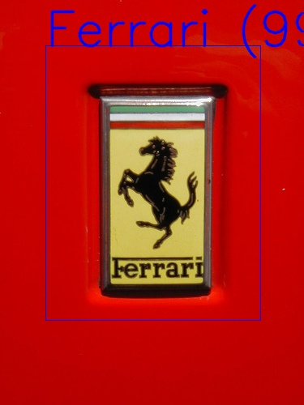
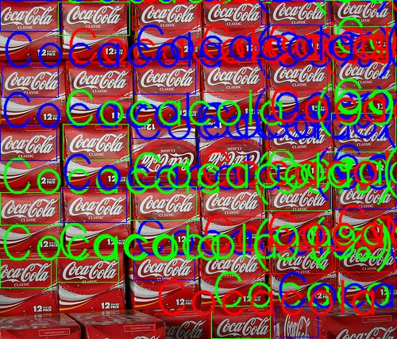
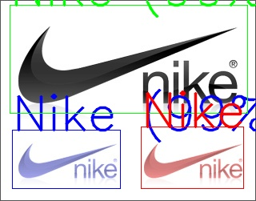
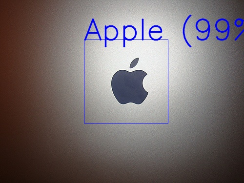
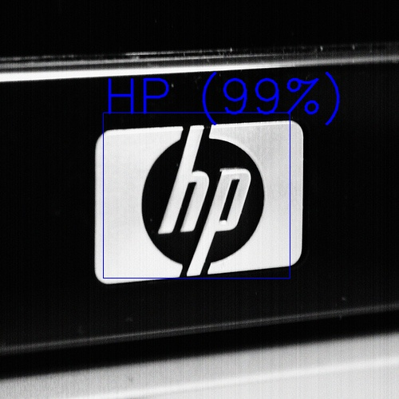

# ssd.pytorch.plug-and-play
## Philosophy
Implementation of the generalized SSD architecture in pytorch.
This implementation tries to simplify the learning process of an SSD in different ways:
- It is a single file + models folder, which allows a quick adaptation to the project where you want to use it.
- It is easy to use this scheme to implement other architectures such as SSD-512, Mobilenet, etc... (new architectures will be added in future updates)
  Which allows a correct generalization of models based on the original SSD.
- It is extremely documented what the code tries to do understandable to all and thus be able to improve it continuously.

Much of the code has been influenced by the following implementations:
- https://github.com/amdegroot/ssd.pytorch
- https://medium.com/@smallfishbigsea/understand-ssd-and-implement-your-own-caa3232cd6ad

¡That is why all the gratitude belongs to them!

## Train with own Dataset
You can directly use the train.py file to train with your dataset. This includes the monitoring of learning using tensorboardX and split train and validation.

To learn a new model in our dataset, only need to create nn.Dataset class, this must be return in the ``` __getitem__(self, index) ``` method the following elements:
- image (size does not matter)
- arrray numpy from:

  - x1 (top-left x corner with respect to the image coordinates).
   
  - y1 (top-left y corner with respect to the image coordinates).
   
  - x2 (bottom-right x corner with respect to image coordinates).
   
  - y2 (bottom-right y corner with respect to image coordinates).
   
  - index of the class.

See the dataset / logos / LogoDataset class for more information.

## Save/Load
In order to simplify the process the SSD class includes the following methods:
- save_model: save the weights and also includes another interesting information to reload (the architecture used and the number of classes).
- load_model: only load the weights.
- SSD.load: static that first create the correct SSD architecture and after load the weights. 

This allows you to avoid the implicit methods of 'save' and 'load' the torch to minimize incomptabilities, refactoring, etc  that could produces the model unusable.

## Predict
Also include a method called predict, this method do the following:
- Need a list of numpy images. In default BGR channel order is enabled (Opencv style, cv.imread default).
- Apply the selected architecture normalization (optional, true by default).
- Return the results in images coordinates (optional, true by default).

The result is a list that contain the prediction for each image. 
Each prediction is another list of objects thats appear in the image.
Each object is a dict with the following structure: 'class', 'confidence' and 'position'.
Example:
```[  
   # Image 1
   [
      # Object 1  
      {  
         'class':25,
         'confidence':0.9746715426445007,
         'position':array(         [  
            74.66616,
            4.335227,
            420.09085,
            240.87614
         ],
         dtype=float32)
      }
   ],
   # Image 2
   [  
      # Object 1
      {  
         'class':7,
         'confidence':0.9997352957725525,
         'position':array(         [  
            56.938816,
            56.414486,
            321.53543,
            395.46677
         ],
         dtype=float32)
      }
   ],
   # Image 3
   [  
      # Object 1
      {  
         'class':4,
         'confidence':0.9997932314872742,
         'position':array(         [  
            168.33128,
            319.57376,
            245.24002,
            352.5268
         ],
         dtype=float32)
      },
      # Object 2
      {  
         'class':4,
         'confidence':0.9992842078208923,
         'position':array(         [  
            2.1288916e-01,
            2.4200673e+02,
            7.5600105e+01,
            2.8358530e+02
         ],
         dtype=float32)
      }
   ]
]

```


## Pretrained models
TODO

## Data augmentation
The imgaug library is used to apply data augmentation, which makes the process very simple. https://imgaug.readthedocs.io/en/latest/

## Examples:









